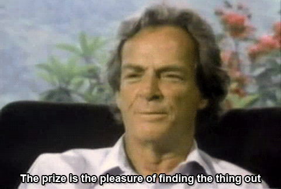

# Hey, I'm Jesuino 👋

With nearly 5 years of experience as a **data scientist** and **software developer** at [IconPro GmbH](https://iconpro.com/en/), I’m now applying for a Master’s program to further expand my expertise. My research interests lie in the **interdisciplinary applications** of data science, particularly in **bioinformatics** and **neuroscience**, where I strive to learn and develop techniques for the benefit of all.

> My github hosts a collection of projects from my bachelor's studies (organized by course)

  

